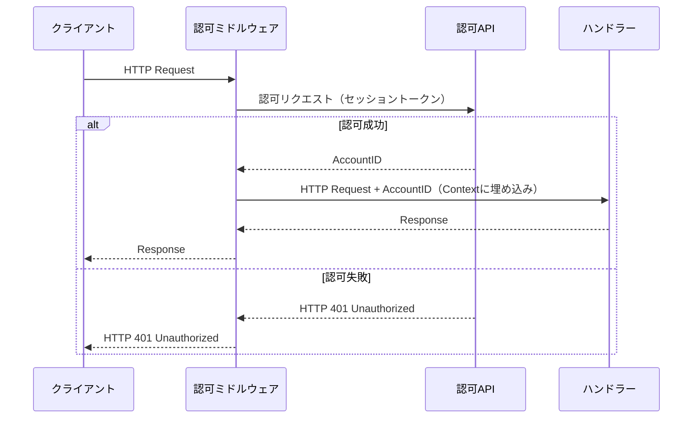

# 概要

認可Middlewareを作成する.

# 対象範囲

## 達成基準

- 認可Middlewareが作成されRouterから呼び出しが可能な状態
- 成功時にAccountIDをHandlerから参照可能な状態

## 除外項目

- AccountIDを参照する実際のHandler作成は行わない

# 利用方法

## シーケンス

# 詳細設計

## 要件

- セッショントークンを用いて認可を行う

## 仕様

- Middlewareで認可APIにリクエストし認可を行う
  - リクエスト時にセッショントークンを認可APIに渡す
  - 成功時はAPIからAccountIDが返却される
- 成功時はUserIDをContextに詰めてからHandlerを呼び出す
- 失敗時はUnauthorizedClientに返却する

## ドメインオブジェクト

| キー | 型 | 備考 |
| --- | --- | --- |
| account_id | uuid | |

## テスト項目

| ステータス | テストケース | 入力値 |
| --- | --- | --- |
| 正常系 | 認可成功 | token |
| 異常系 | 認可失敗 | token |
| 異常系 | リクエスト失敗 | token |

# その他の手法

# 参考文献

# 変更履歴

| 変更日 | 変更者 | 変更内容 |
| --- | --- | --- |
| 2025/04/09 | @atsumarukun | 初版 |
