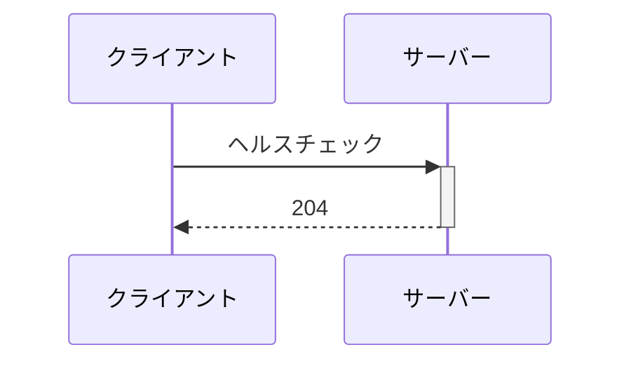

# 概要

ヘルスチェック機能を作成する.

# 対象範囲

## 達成基準

- ヘルスチェック用エンドポイントが作成されている

## 除外項目

- ヘルスチェック失敗時の対応は行わない

# 利用方法

## エンドポイント

| パス | メソッド | 備考 |
| --- | --- | --- |
| /health | GET | ヘルスチェック |

## シーケンス

# 詳細設計

Interface層で204を返却し、Usecase層やDomain層の実装は行わない.

# その他の手法

# 参考文献

# 変更履歴

| 変更日 | 変更者 | 変更内容 |
| --- | --- | --- |
| 2025/04/09 | @atsumarukun | 初版 |
