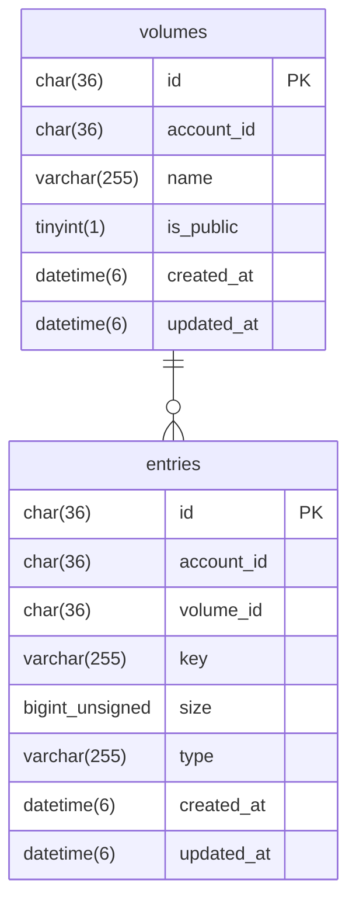

```mermaid
erDiagram

volumes {
  char(36) id PK
  char(36) account_id
  varchar(255) name
  tinyint(1) is_public
  datetime(6) created_at
  datetime(6) updated_at
}

entries {
  char(36) id PK
  char(36) account_id
  char(36) volume_id
  varchar(255) key
  bigint_unsigned size
  varchar(255) type
  datetime(6) created_at
  datetime(6) updated_at
}

volumes ||--o{ entries: ""
```
